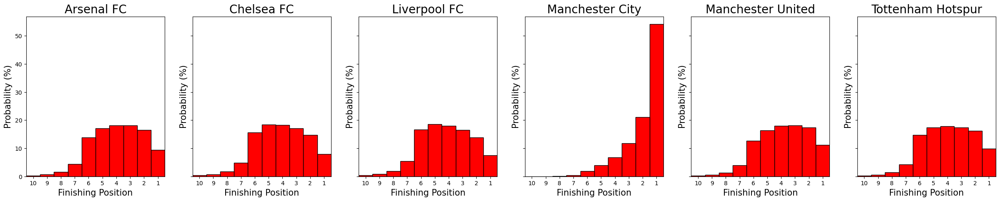
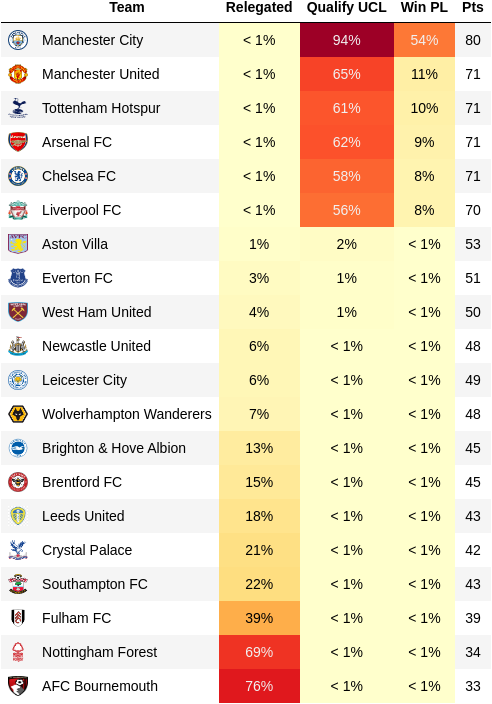

# Predicting Soccer Games Outcomes

This project is inspired by the University of Michigan's [Prediction Models with Sports Data](https://www.coursera.org/learn/prediction-models-sports-data) course offered through Coursera as part of the [Sports Performance Analytics specialization](https://www.coursera.org/specializations/sports-analytics).

In the course, a forecaster of the outcomes of Premier League soccer games is built based on the [transfermarkt](https://www.transfermarkt.com/) value (TMValue) of the teams. One of the limitations stems from having a single TMValue for each team for the entire season. This value is in general updated twice every month and therefore there should be added value in using the most updated values. For this project, we will explore if that is indeed the case. Then we will use the model to simulate the rest of the 2022-2023 Premier League season.

We will use the following two data sources:
- [football-data](https://www.football-data.co.uk/englandm.php): from here we can easily obtain basic statistics for every Premier League game and Bet365 odds.
- [transfermarkt](https://www.transfermarkt.com/): TMValue for each team in the Premier League (and lower divisions) since the 2010-2011 season. We will gather as well the final standings and classical statistics for each season (to be used in the future) 

The project is divided in three steps:
1. Gather Data
2. Normalize Data
3. Create Forecasting Models
4. Predict the Premier League's 2022-2023 Season

Before describing in detail each step, we highlight the results of our prediction for the Premier League's 2022-2023 Season. First, we show the end of the season finishing position probabilities for each team in the Big Six and then the probabilities of winning the Premier League, qualifying for the Uefa Champions League and being relegated, as well as the expected number of points (last updated 2022-09-18).

## First Step: Gather Data

The following interactive Jupyter Notebooks can be used to download and scrap the data.

`Downloading Data from football-data.ipynb`

This notebook allows you to download the data from football-data. While more seasons are available, we only download the data starting with the 2010-2011 season as this is the first one for which the TMValue data is available.

While the data from football-data is already available in easy to download .csv files, the same is not true for the data in transfermarkt. In concrast, we must scrap the data.

`Scrapping Data from TransferMarket (League Standings).ipynb`

This notebook collects the final league standings for the Premier League going back to the 2010-2011 season.

`Scrapping Data from TransferMarkt (TMValue).ipynb`

This notebook scraps the TMValue for all teams that are currently (2022) in either the Premier League, Championship or League one. This allows us to have the TMValue for all teams that have played in the Premier League since the 2010-2011 season.

## Second Step: Normalize Data

After gathering the data, we notice that the team names are inconsistent across the different tables. While this is to be expected since we are using two different sources, the inconsistencies also appears within the transfermarkt tables. Moreover, the dates are saved as strings and their formats also inconsistent as well. We convert them all to the same format (timestamps), which also allows us to add the most update TMValues of the teams at each game as well as at the beginning of the season. All of this is accomplished in the Jupyter Notebook `Normalizing Data.ipynb`.

## Third Step: Create Forecasting Models

We use the log of the ratio between the TMValue of each team as our predictive feature. We create two models based on the TMValue at the beginning of the season as well the most updated values along the season. All of this is accomplished in the Jupyter Notebook `Predicting Soccer Games Outcomes (Baseline).ipynb`.
